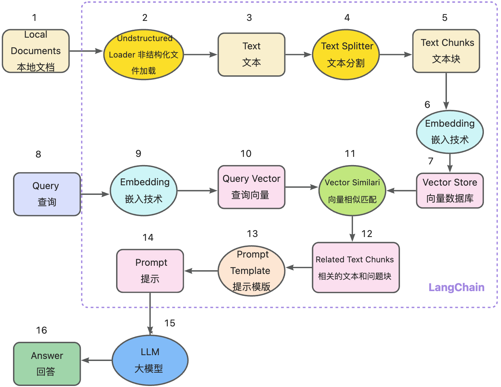
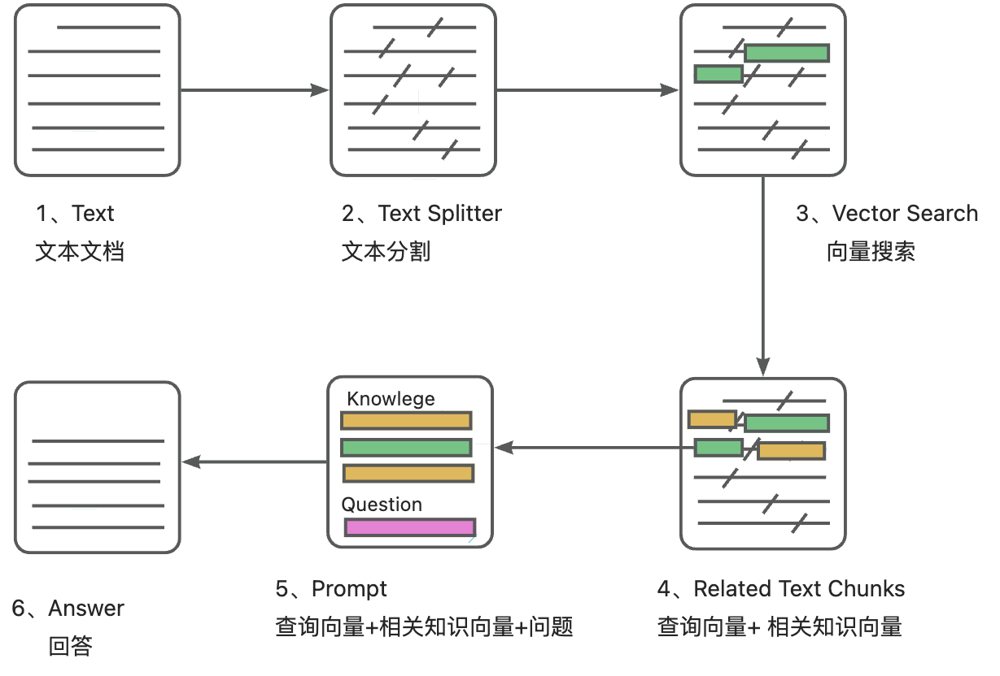
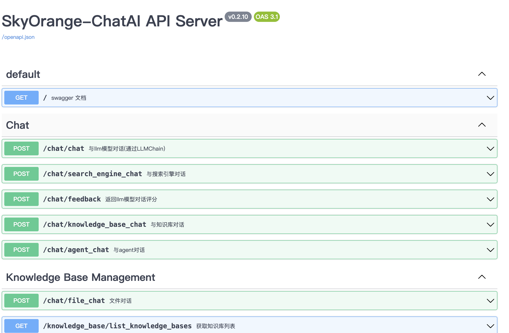
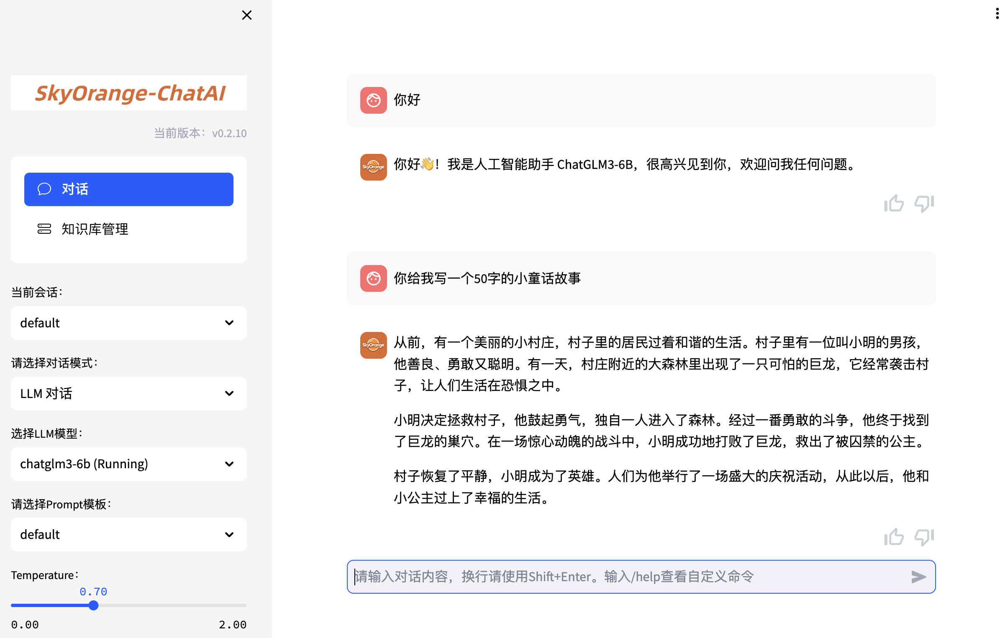
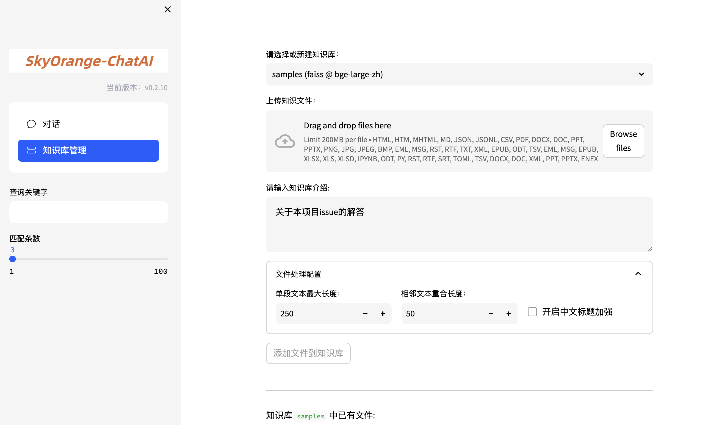

📃 **orange-Langchain** (原 Langchain-ChatGLM)

基于 ChatGLM 等大语言模型与 Langchain 等应用框架实现，开源、可离线部署的检索增强生成(RAG)大模型知识库项目。

## 目录

* [介绍](README.md#介绍)
* [解决的痛点](README.md#解决的痛点)
* [快速上手](README.md#快速上手)
  * [1. 环境配置](README.md#1-环境配置)
  * [2. 模型下载](README.md#2-模型下载)
  * [3. 初始化知识库和配置文件](README.md#3-初始化知识库和配置文件)
  * [4. 一键启动](README.md#4-一键启动)
  * [5. 启动界面示例](README.md#5-启动界面示例)
* [联系我们](README.md#联系我们)

## 介绍

🤖️ 一种利用 [langchain](https://github.com/langchain-ai/langchain)
思想实现的基于本地知识库的问答应用，目标期望建立一套对中文场景与开源模型支持友好、可离线运行的知识库问答解决方案。

💡 受 [GanymedeNil](https://github.com/GanymedeNil) 的项目 [document.ai](https://github.com/GanymedeNil/document.ai)
和 [AlexZhangji](https://github.com/AlexZhangji)
创建的 [ChatGLM-6B Pull Request](https://github.com/THUDM/ChatGLM-6B/pull/216)
启发，建立了全流程可使用开源模型实现的本地知识库问答应用。本项目的最新版本中通过使用 [FastChat](https://github.com/lm-sys/FastChat)
接入 Vicuna, Alpaca, LLaMA, Koala, RWKV 等模型，依托于 [langchain](https://github.com/langchain-ai/langchain)
框架支持通过基于 [FastAPI](https://github.com/tiangolo/fastapi) 提供的 API
调用服务，或使用基于 [Streamlit](https://github.com/streamlit/streamlit) 的 WebUI 进行操作。

✅ 依托于本项目支持的开源 LLM 与 Embedding 模型，本项目可实现全部使用**开源**模型**离线私有部署**。与此同时，本项目也支持
OpenAI GPT API 的调用，并将在后续持续扩充对各类模型及模型 API 的接入。

---


⛓️ 本项目实现原理如下图所示，过程包括加载文件 -> 读取文本 -> 文本分割 -> 文本向量化 -> 问句向量化 ->
在文本向量中匹配出与问句向量最相似的 `top k`个 -> 匹配出的文本作为上下文和问题一起添加到 `prompt`中 -> 提交给 `LLM`生成回答。



从文档处理角度来看，实现流程如下：



## 快速上手

接着，创建一个虚拟环境，并在虚拟环境内安装项目的依赖

```shell

# 拉取仓库
$ git clone https://github.com/Tian789Gong/-LCchat.git

# 进入目录
$ cd ./-LCchat
# 安装全部依赖
$ pip install -r requirements.txt 
$ pip install -r requirements_api.txt
$ pip install -r requirements_webui.txt  

# 默认依赖包括基本运行环境（FAISS向量库）。如果要使用 milvus/pg_vector 等向量库，请将 requirements.txt 中相应依赖取消注释再安装。
```

### 2. 模型下载

如需在本地或离线环境下运行本项目，需要首先将项目所需的模型下载至本地，通常开源 LLM 与 Embedding
模型可以从 [HuggingFace](https://huggingface.co/models) 下载。

以本项目中默认使用的 LLM 模型 [THUDM/ChatGLM3-6B](https://huggingface.co/THUDM/chatglm3-6b) 与 Embedding
模型 [BAAI/bge-large-zh](https://huggingface.co/BAAI/bge-large-zh) 为例：

下载模型需要先[安装 Git LFS](https://docs.github.com/zh/repositories/working-with-files/managing-large-files/installing-git-large-file-storage)
，然后运行

```Shell
$ sudo apt-get update
$ sudo apt-get install git-lfs
$ git lfs install
$ git clone https://huggingface.co/THUDM/chatglm3-6b
$ git clone https://huggingface.co/BAAI/bge-large-zh
```

### 3. 初始化知识库和配置文件

按照下列方式初始化自己的知识库和简单的复制配置文件

```shell
$ python copy_config_example.py
$ python init_database.py --recreate-vs
```

### 4. 一键启动

按照以下命令启动项目

```shell
$ python startup.py -a
```

### 5. 启动界面示例

如果正常启动，你将能看到以下界面

1. FastAPI Docs 界面



2. Web UI 启动界面示例：

- Web UI 对话界面：



- Web UI 知识库管理页面：


