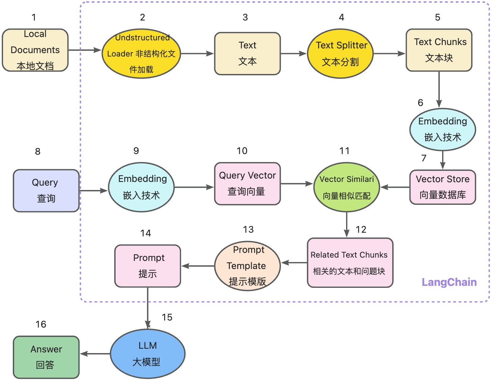
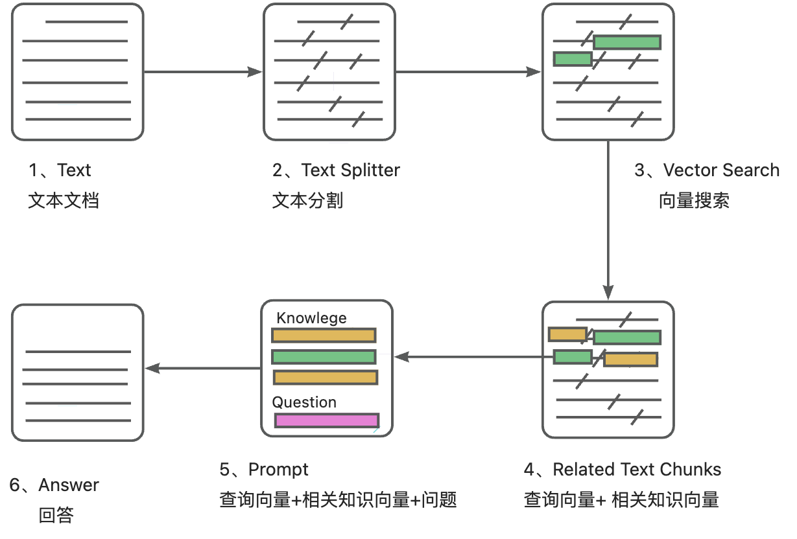

🌍 [READ THIS IN ENGLISH](README_en.md)

📃 **SkyOrange-ChatAI** 

An open-source, offline deployable Retrieval-Augmented Generation (RAG) large model knowledge base project based on large language models like ChatGLM and application frameworks like Langchain.

---

## Table of Contents

* [Introduction](README.md#项目介绍)
* [Pain Points Solved](README.md#解决的痛点)
* [Quick Start](README.md#快速上手)
    * [1. Install Project Dependencies](README.md#一安装项目依赖)
    * [2. Model Download](README.md#二模型下载)
    * [3. Initialize Knowledge Base and Configuration Files](README.md#三初始化知识库和配置文件)
    * [4. One-Click Start](README.md#四一键启动)
    * [5. Start Interface Examples](README.md#五启动界面示例)
* [Contact Us](README.md#联系我们)

## Introduction

🤖️ A question-answering application based on local knowledge base using [langchain](https://github.com/Tian789Gong/SkyOrange-ChatAI.git), aimed at establishing a knowledge base QA solution that is friendly to Chinese scenarios and open-source models, and can run offline.

✅ Based on the open-source LLM and Embedding models supported by this project, it can achieve **offline private deployment** using all **open-source** models. Meanwhile, this project also supports OpenAI GPT API calls and will continue to expand the access to various models and model APIs.

⛓️ The implementation principle of this project is shown in the figure below, which includes loading files -> reading text -> text segmentation -> text vectorization -> question vectorization -> matching the most similar `top k` texts in the text vectors -> adding the matched texts as context to the `prompt` along with the question -> submitting to `LLM` to generate answers.



From a document processing perspective, the implementation process is as follows:



🚩 This project does not involve fine-tuning or training, but it can use fine-tuning or training to optimize the project effects.

## Pain Points Solved

This project is a knowledge base enhancement solution that can achieve __fully localized__ inference, focusing on solving enterprise pain points of data security protection and private deployment. This open-source solution uses ```Apache License```, which allows free commercial use without any fees.

We support mainstream local large language models and Embedding models, and also support open-source local vector databases.

## Quick Start

### 1. Install Project Dependencies
#### 1. Confirm Python Version

```shell
# Confirm the Python version, it should be Python 3.8~3.11
python3 --version

# If the version meets the requirements, you can skip to the next step: 2. Install Project Dependencies; if not, follow the steps below to update the Python version
# Create a Python 3.11 virtual environment
conda create -n env_name python=3.11

# Activate the conda environment
conda activate env_name

# Upgrade pip
pip install --upgrade pip

# Deactivate the environment
conda deactivate

# Remove the environment
conda env remove -n env_name
```

#### 2. Install Project Dependencies
##### 2.1. Install NVIDIA Drivers
```shell
# Update system package index
sudo apt-get update

# Install NVIDIA drivers
sudo ubuntu-drivers autoinstall

# Restart the system, you might need to reconnect to the server after restarting.
sudo reboot

# After a successful restart, verify if the NVIDIA driver is correctly installed and loaded
nvidia-smi 
```

##### 2.2. Install Dependencies from the Project's Requirements File
```shell
# Clone the project repository
git clone https://github.com/Tian789Gong/SkyOrange-ChatAI.git

# Enter the project directory
cd SkyOrange-ChatAI

# Install all dependencies by running the following three commands to execute the requirements.txt file
pip install -r requirements.txt
pip install -r requirements-gpu.txt
pip install -r requirements-doc.txt
```

### 2. Model Download
#### 1. Clone the Required Model Repositories
```shell
# Create a directory to store the models
mkdir -p /root/models

# Enter the models directory
cd /root/models

# Clone the ChatGLM-3.6B model repository from Hugging Face
git clone https://huggingface.co/THUDM/chatglm-6b-int4

# Enter the ChatGLM-3.6B directory
cd chatglm3-6b

# Pull the LFS files
git lfs pull

# List LFS objects
ls -lh .git/lfs/objects

# List LFS files to check their integrity; if all files show a * it means they are complete. If not, delete the files and re-clone the repository
git lfs ls-files

# Return to the previous directory
cd ..

# Clone the bge-large-zh repository from ModelScope
git clone https://www.modelscope.cn/AI-ModelScope/bge-large-zh.git

# Enter the bge-large-zh directory
cd bge-large-zh

# Pull the LFS files
git lfs pull

# List LFS objects
ls -lh .git/lfs/objects

# List LFS files to check their integrity; if all files show a * it means they are complete. If not, delete the files and re-clone the repository
git lfs ls-files 
```

### 3. Initialize Knowledge Base and Configuration Files
#### 1. Initialize Knowledge Base
```shell
# Return to the root directory
cd ~

# Enter the project directory
cd SkyOrange-ChatAI

# Copy configuration example
python3 copy_config_example.py
```

#### 2. Configure Files
##### 2.1 Configure Model Files
```shell
# Enter the configuration files directory
cd configs

# Open the model_config.py file with vi editor
vi model_config.py

# Press the i key to enter insert mode
# Modify the model file directory path
MODEL_ROOT_PATH = "/root/models"

# Modify the selected Embedding model name
EMBEDDING_MODEL = "bge-large-zh"

# Modify the embed_model path in MODEL_PATH = {}
"bge-large-zh": "/root/models/bge-large-zh"

# Modify the llm_model path in MODEL_PATH = {}
"chatglm3-6b": "/root/models/chatglm3-6b"

# Press the esc key to exit insert mode, then type the following to save and exit
:wq
```

##### 2.2 Configure Service Files/Recreate Database
```shell
# Enter the configuration files directory
cd configs

# Open the server_config.py file with vi editor
vi server_config.py

# Press the i key to enter insert mode
# Modify the following key-value pairs in FSCHAT_MODEL_WORKERS = {} under "default"
# Specify the GPU ID to use, in str format like "0,1" for two GPUs or "0" for one GPU
# This depends on your server configuration. Here is an example with 1 GPU and 32G memory
gpus="0" 
num_gpus= 1, 
max_gpu_memory="16GiB"

# Press the esc key to exit insert mode, then type the following to save and exit
:wq

# Return to the root directory
cd ~

# Enter the project directory
cd SkyOrange-ChatAI

# Recreate the database
python3 init_database.py --recreate-vs
```

### 4. One-Click Start

Start the project with the following command

```shell
# Use the startup.py file for one-click start
python3 startup.py -a
```

### 5. Start Interface Examples

If started successfully, you will see the following interfaces

1. FastAPI Docs interface


2. Web UI start interface examples:

- Web UI chat interface:


- Web UI knowledge base management page:


---

## Contact Us

🎉 SkyOrange-ChatAI project discussion QQ group, if you are interested in this project, welcome to join the group for discussions and exchanges.

### Discussion QQ Group


🎉 SkyOrange-ChatAI official QQ group, welcome to scan the code to join.

